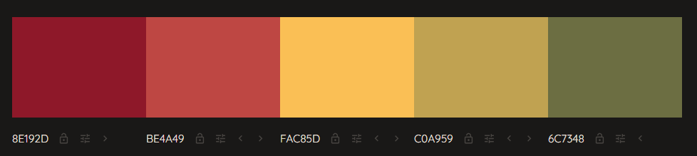

# Rock, Paper, Scissors, Lizard, Spock!

This webgame is an extension of the classic game rock, paper, scissors with 2 extra options!

[rock, paper, scissors, lizard, spock](https://jordankingveoxyl.github.io/rock-paper-scissors-lizard-spock-final/)

## CONTENTS
---
* [User Experience](#user-experience-ux)
  * [User Stories](#user-stories)

* [Design](#design)
  * [Colour Scheme](#colour-scheme)
  * [Typography](#typography)
  * [Wireframes](#wireframes)

* [Features](#features)
  * [Future Implementations](#future-implementations)
  * [Accessibility](#accessibility)

* [Technologies Used](#technologies-used)
  * [Languages Used](#languages-used)
  * [Frameworks, Libraries & Programs Used](#frameworks-libraries--programs-used)

* [Deployment & Local Development](#deployment--local-development)
  * [Deployment](#deployment)
  * [Local Development](#local-development)
    * [How to Fork](#how-to-fork)
    * [How to Clone](#how-to-clone)

* [Testing](#testing)

* [Credits](#credits)
  * [Code Used](#code-used)
  * [Content](#content)
  * [Acknowledgments](#acknowledgments)

## User Experience (UX)
---
Rock, Paper, scissors, Lizard, Spock! is a simple game to play with anybody, or to use for making random decisions based on the winner and loser.

### User Goals
Simple to understand. The user should know exactly what choices they have to make as soon as they enter the webpage and not have to click around the webpage wondering how it functions. The user should know exactly when they win, lose or draw and this information should be conveyed to them by the scoring system I've implemented.

## Design
---
I aimed for fun, playful and childlike colors and font for the site considering it can be played by all ages and be attractive to anyone.

### Colour Scheme

The color palette was created using [Colormind](http://colormind.io/)

### Typography
I used [Google Fonts](https://fonts.google.com/) to select the relevant font for the site. I chose a font called DynaPuff. It is playful, its curves being unstrict and welcoming. It gives off a childish vibe that welcomes the game to all ages. 

### Wireframes

## Features
---
I made the page as simple as possible, with all of the gameplay and information on one page split into three different sections.

- This is the header, indicating the name of the game as well as explaining each choice the user can make in the game. 
There is also a secondary heading pushing the user to 'Make your move!'

- This is the game area in which the user selects a choice for the game to start/continue

- This is the score area in which the user and computer's score is stored and incremented based on the win and lose conditions
If the user and computer select the same choice then the score will not be incremented

### Future Implementations

- A toggle that can indicate the best out of a desired number of rounds. This could then alert the user that the user or the computer won the select number of rounds. 
- A restart button that doesn't require the user to reload the page.
- More interactive features like the page changing color to green when the user wins and red when the user loses. 

### Accessibility

For the accessibility, I implimented:

- Semantic HTML.
- Sufficient colour contrast.
- Clear and large options for choices. 

## Technologies Used
---
### Languages Used

- HTML
- CSS
- JavaScript

### Frameworks, Libraries & Programs Used

- Github
- Gitpod
- Google Fonts
- Google Dev Tools
- Am I Responsive?
- w3 schools

## Deployment & Local Development
---
### Deployment

Github Pages was used to deploy the live website. The instructions to achieve this are below:

- Log in (or sign up) to Github.
- Find the repository for this project, rock-paper-scissors.
- Click on the Settings link.
- Click on the Pages link in the left hand side navigation bar.
- In the Source section, choose main from the drop down select branch menu. 
- Select Root from the drop down select folder menu.
- Click Save. Your live Github Pages site is now deployed at the URL shown.

### Local Development

#### How to Fork

To fork the Rock Paper Scissors repository:

- Log in (or sign up) to Github.
- Go to the repository for this project, JordanKingVeoxyl/rock-paper-scissors-lizard-spock-final
- Click the Fork button in the top right corner..

#### How to Clone

To clone the Rock Paper Scissors repository:

- Log in (or sign up) to GitHub.
- Go to the repository for this project, MaryAnneLee/rock-paper-scissors
- Click on the code button, select whether you would like to clone with HTTPS, SSH or GitHub CLI and copy the link shown.
- Open the terminal in your code editor and change the current working directory to the location you want to use for the cloned directory.
- Type 'git clone' into the terminal and then paste the link you copied in step 3. Press enter.

## Testing
---
- Chrome developer tools was used to find any issues while building the webpage.

- The W3C validators for HTML and CSS was used when the webpage was finsihed. JSHint was used for JavaScript.

- Lighthouse Testing

### Solved Bugs

- Although the website, by the user's perspective was working correctly, there was still an error - stating that each choice the user selected would print in the console as null. This ended up being due to the fact that I didn't label by variables correctly, changing them from the words for the choices (i.e. rock, paper, scissors, etc) instead of the letters that converted to those words later on in the code's process (r, p, s, etc). My mentor and tutors helped me figure this out by printing console.log in numerous places in my code and following where it led me. It took me a while but taught me a lot in the process.

## Credits
---
### Code Used

Inspiration and code came from four diffrent tutorials on YouTube and other students' previous projects.

- [Web Dev simplified - How to code Rock Paper Scissors](https://www.youtube.com/watch?v=1yS-JV4fWqY)

- [Whatsdev - How to Build a Rock Paper Scissors Game with Html, Css, and Javascript part 1](https://www.youtube.com/watch?v=qipq1BV5myU)

- [Whatsdev - How to Build a Rock Paper Scissors Game with Html, Css, and Javascript part 2](https://www.youtube.com/watch?v=Qqy8Ov3NWvQ)

- [Code with Ania Kubow - 3 Ways to Code Rock, Paper, Scissors in JavaScript (Beginner to Advanced!)](https://www.youtube.com/watch?v=RwFeg0cEZvQ&t=1225s)

- [https://github.com/MaryAnneLee/Rock-Paper-Scissors/](https://github.com/MaryAnneLee/Rock-Paper-Scissors/)

- [https://github.com/Meyaal/Game](https://github.com/Meyaal/Game)

- [The readme template came from Kera Cudmore from GitHub](https://github.com/kera-cudmore/readme-examples/blob/main/milestone1-readme.md)

### Content

I wrote the content for this website.
  
### Acknowledgments

Thanks to my mentor Martina and the helpful tutors for helping me fix bugs and leading me in the right direction. Also thanks to Kera Cudmore for the great Readme-file template. 
